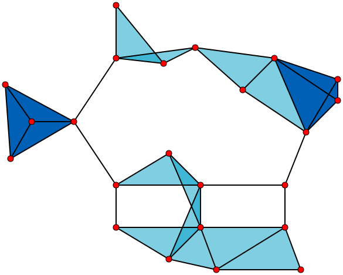
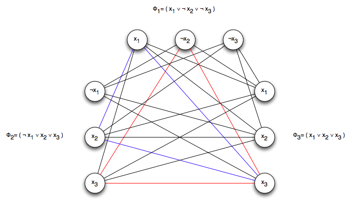


Word in the street is that you can solve \(\bold{P}~vs.~\bold{NP}\) by proving
that the language \(\sf 3SAT\) is in \(\bf P\) or not. Fine. We already know that
some languages are the quintessence of their class. But how can we prove it ?
How can we compare languages to each other ? In one word: reduction.

And to witness such a phenomenon, let's observe some good ol' practical examples.

## Some problems

First of all, we need some problems to study. We have thus chosen 3 language in
the \(\bf NP\) class to do so.

### `SAT` and `3SAT`

We say that a [boolean formula](https://en.wikipedia.org/wiki/Boolean_algebra) is
satisfiable if at least one assignment of its variables evaluates to `TRUE`.

For example the formula \(\varphi = (u_1 \land \lnot u_2) \lor (u_2 \land u_3)\)
is satisfiable because the assignement \(u_1 = 1,~u_2 = 0,~u_3 = 0\), gives \(\varphi = 1\)
(\(0\) and \(1\) are common shorthands for  `TRUE` and `FALSE`).

A formula is a Conjunctive Normal Form (CNF) if it's an `AND` of `OR`s. That is
a formula \(\varphi\) over the variables \(u_1,...,u_n\) is
a CNF if it's of the form :

$$
\bigwedge_{i}(\bigvee_{j} v_{i_j}),~where~v_{i_j}=u_k~or~v_{i_j}=\lnot u_k
$$

For instance the following formula is a CNF:  

\((u_1 \lor \lnot u_2 \lor u_3) \land (u_2 \lor u_4 \lor u_5 \lor \lnot u_6)
\land (u_3 \lor u_4)\)

NB: The terms \(v_{i_j}\) are called the literals of the formula
and the terms \((\bigvee_{j} v_{i_j})\) are called its clauses. The above example
the formula has 3 clauses with, respectively, 3, 4 and 2 literals.


Every boolean formula can be
[converted](https://en.wikipedia.org/wiki/Conjunctive_normal_form#Conversion_into_CNF)
to an equivalent CNF of at most exponential size or -- more importantly -- an equisatisfiable
CNF that is guaranteed to only linearly increase the size of the formula. Hence for
all intents and purposes we can focus solely on CNFs.

Which gives us our definitions:  

\(\sf SAT\) language, short for \(\sf SATISFIABILITY\), is the set of all satisfiable CNFs.
  

\(\sf 3SAT\) language is the set of all satisfiable CNFs whose clauses have at most 3 literals.


### `CLIQUE`

In [graph theory](https://en.wikipedia.org/wiki/Graph_theory) a clique is a complete
subgraph. That is a subgraph where all vertices are connected to each others.


A graph with

- 23 × 1-vertex cliques (the vertices),
- 42 × 2-vertex cliques (the edges),
- 19 × 3-vertex cliques (light and dark blue triangles), and
- 2 × 4-vertex cliques (dark blue areas).

The 11 light blue triangles form maximal cliques. The two dark blue 4-cliques are
both maximum and maximal, and the clique number of the graph is 4.



The \(\sf CLIQUE\) language is the set of all graphs \(G\) with a clique of size
at least \(k\). Or formally:


$$
\mathsf{CLIQUE}=\lbrace \langle G,k \rangle : \exists S \subseteq V(G)
~s.t.~|S| \ge k~and~\forall u,v \in S,~\lbrace u,v \rbrace \notin E(G) \rbrace
$$

## Reduction

Onto the main topic of this entry.  
Reductions are a way to cast a problem into another. But they're are rules to do
such a transformation. For example, as we are intersted in polynomial runtime, our
reduction should also be doable in such time as a way to not alter this property
if we wanted to use it to solve the problem. As a reduction is runs on an hypothetical
TM it can utilize different powers (e.g. non-determinism, randomness [^later], oracles [^later],
etc.). Here we'll use a deterministic TM.

The simplest kind of polynomial time reduction on a deterministic machine is a Karp-reduction
noted \(L \le_{p} L'\) if \(L\) is polynomial time Karp reducible to \(L'\).
A Karp-reduction consist in converting the instances of \(L\) into instances in
\(L'\). Formally, \(L,L'~\subseteq~\{0,1\}^*,\,L \le_{p} L' \iff \exists f: \{0, 1\}^∗ \rarr \{0, 1\}^∗\),
a polynomial-time computable function s.t. \(\forall x \in \{0, 1\}^∗,~x \in L \iff f(x) \in L'\)
.

[^later]: That's a story for another time :wink:

### `SAT` to `3SAT`


The method here is as follows: For a CNF \(\varphi\) replace each of its clause
with a set of clause, each having exactly 3 literals thus making it a 3-CNF.
There is 4 different cases to solve:

#### Case 1: 1 literal clause


Let \(C\) consist of a single literal \(\ell\). \(\ell\) is either \(x_i\) or \(\lnot x_i\)
for some i. Let \(z_1\) and \(z_2\) be two new variables. We replace \(C\) by
:  

\((\ell \lor z_1 \lor z_2) \land (\ell \lor \lnot z_1 \lor z_2) \land
(\ell \lor z_1 \lor \lnot z_2) \land (\ell \lor \lnot z_1 \lor \lnot z_2)\)
.  

Clearly when \(\ell = 1\), \(C = 1\). When \(\ell = 0\), then there are no assignment
of \(z_1\) and \(z_2\) that could make \(C = 1\). The 2 formulas are equivalent.


#### Case 2: 2 literals clause


Let \(C = \ell_1 \lor \ell_2\). Each of \(\ell_1\) and \(\ell_2\) are either \(x_i\)
or \(\lnot x_i\). Let \(z\) be a new variable. We replace \(C\) by
:  

\((\ell_1 \lor \ell_2 \lor z) \land (\ell_1 \lor \ell_2 \lor \lnot z)\)
.  
Same here, 2 equivalent formulas.

#### Case 3: 3 literals clause

This is a rare occasion for me but I feel like I can safely say that this is trivial.

#### Case 4: k literals clause


Let \(k > 3\) and \(C = \ell_1 \lor ... \lor \ell_k\), where each \(l_i\) is either
\(x_i\) or \(\lnot x_i\). Let \(z_1, ..., z_{k−3}\) be \(k − 3\) new variables.
We replace C by the following \(k − 3\) clauses:  

\((\ell_1 \lor \ell_2 \lor z_1) \land (\ell_3 \lor \lnot z_1 \lor z_2) \land
(\ell_4 \lor \lnot z_2 \lor z_3) \land ... \land (\ell_{k−2} \lor \lnot z_{k−4}
\lor z_{k−3}) \land (\ell_{k−1} \lor \ell_k \lor \lnot z_{k−3})\)
.


This time it's different. The 2 formulas are not equivalent but we can prove
that they are equisatisfiable. Let's name the latter formula \(\psi\). There are
2 cases to consider.


1. 
  When \(C\) is not satisfied neither can be \(\psi\). This is implied by the fact
  that is \(C = 0\) then \(\forall \ell_i = 0\). If we try to satisfy \(\psi\) we
  must set \(z_1 = 1\) but this forces us to set \(z_2 = 1\), etc. So \(\forall z_i = 1\).
  But that means that \((\ell_{k−1} \lor \ell_k \lor \lnot z_{k−3}) = 0\). Thus
  \(\psi\) is not satisfiable.
  
2. 
  When \(C\) is satisfied also can \(\psi\). This means that \(\exist \ell_i = 1\).
  Let's assume that only one literal \(\ell_i\) is \(TRUE\) and is in a clause \(C_{\psi}\)
  in \(\psi\). Then \(C_{\psi} = (\ell_i \lor \lnot z_{i-2} \lor z_{i-1})\) (except
  for \(i = \{1,2,k-1,k\}\), but those are just special cases of this solution).
  Set \(z_{i-2} = 1\) and \(z_{i-1} = 0\) and then all the values of the other
  \(z_j\) will follow (i.e. \(\forall j \le i - 2,\,z_j = 1\) and
  \(\forall j \ge i - 1,\,z_j = 0\)).
  

All of these conversion are clearly doable in polynomial time. This conclude our
reduction.

### `3SAT` to `CLIQUE`

For this one we operate like this:


Given a CNF \(\varphi\) with k clauses  we will create a graph \(G\) with a k-clique
if \(varphi\) is satisfiable. Each literals of \(\varphi\) is a vertex in \(G\).
Literals in the same clause form a cluster of vertices. To add the edges we apply
these 2 rules:


1. There is no edges between any pair of nodes in the same cluster

2. There is an edge between all pairs of nodes in different cluster except for
  the pair of the form \(\{x_i, \lnot x_i\}\)





The resulting graph (which can be done in polynomial time) has the following properties:

1. If 2 vertices are connected then the corresponding literals can simultaneously be
  assigned `TRUE` and vice-versa (not accounting for clusters).

2. If the graph has a k-clique then each vertices comes from different cluster and
  their corresponding literals can be assigned `TRUE`. Thus the formula is satisfiable.

3. If the formula is satisfiable then when satisfied at least one literal is `TRUE` per
  clause. Which means that there is k corresponding vertices that can form a clique.

## Formal `NP`-hardness


With the concept of reduction we can establish what \(\bf NP\)-hardness is formally
:  

\(L\) is \(\mathbf{NP}\)-hard \(\iff \forall L' \in \mathbf{NP},\,L' \le_p L\)
.  
Note that it can be adapted for different definition of hardness for other classes.

Of course it would be quite tedious to use this definition literally and try to
exhaustively prove every reduction (some could say that it would take an eternity).
Instead -- like always -- we use a clever demonstration.
And then when we know that one problem is complete we can show that others are also
complete by reducing the complete problem to them. For example, we know that
[\(\sf SAT\) is \(\bf NP\)-complete](http://www.cs.toronto.edu/~lalla/373s16/notes/CSAT2SAT.pdf).

Thus with the previous reduction we also know that \(\sf 3SAT\) and \(\sf CLIQUE\)
are \(\bf NP\)-complete.


It is thus clear why proving that \(\sf 3SAT\) is reducible to a problem in \(\bf P\)
would imply that \(\bold{P} \ne \bold{NP}\).
On that note, it is interesting to observe that
[\(\sf 2SAT\) is in \(P\)](https://www.iitg.ac.in/deepkesh/CS301/assignment-2/2sat.pdf).

So close yet so far :pensive:, the embodiment of the
\(\bold{P}~vs.~\bold{NP}\) experience.
